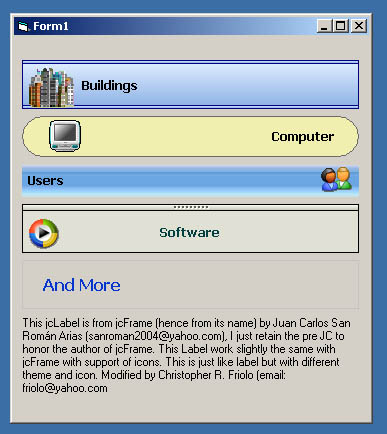



## jcLabel

### Description

jcLabel is a label with Style, theme color and icon project modified from jcFrame (hence the name) authored by Juan Carlos San Roman Carias here in PSC. I think about a simple one the frame to make it label that i going to use im my program. Big thnx to Carlos, hope you like it. If any errors kindly inform me since i did not start this there may be variables which are not neccesary any more.
 
### More Info
 

             |
---                |---
**Submitted On**   |2006-01-12 04:20:02
**By**             |[Cris Friolo](https://github.com/Planet-Source-Code/PSCIndex/blob/master/ByAuthor/cris-friolo.md)
**Level**          |Intermediate
**User Rating**    |4.7 (14 globes from 3 users)
**Compatibility**  |VB 6\.0
**Category**       |[Miscellaneous](https://github.com/Planet-Source-Code/PSCIndex/blob/master/ByCategory/miscellaneous__1-1.md)
**World**          |[Visual Basic](https://github.com/Planet-Source-Code/PSCIndex/blob/master/ByWorld/visual-basic.md)
**Archive File**   |[jcLabel1964491122006\.zip](https://github.com/Planet-Source-Code/cris-friolo-jclabel__1-64014/archive/master.zip)

